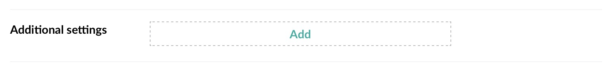

# Key/Value Editor for Umbraco

This property editor is *heavily* based on the **Multiple Textstrings** built-in
property editor, so should look and behave very similar to that one, even though
it has twice as many textboxes. (So hitting <kbd>Enter</kbd>/<kbd>Return</kbd>
adds another set, and you can sort them by using the handles on the right.)

It should work in Umbraco 7 as well as in Umbraco 8.

## Screenshots

### Property editor

**No data**



***

**Added set - blank**


***

**With content**

### Configuration


## Using the editor

When creating a new DataType, choose `Key/Value Editor` as the property
editor.

As with **Multiple Textstrings** you can specify a minimum number of key/value 
sets, as well as a maximum.

## Rendering the output

You should grab the appropriate Property Value Converter from the release page
and add that to your solution (or put it directly into the `App_Code/` folder).

Then you can render the results like this using Models Builder
(assuming your property was named **Additional settings** with the
alias `additionalSettings`):

```razor
<dl>
  @foreach(var setting in Model.AdditionalSettings) {
    <dt>@(setting.Key)</dt>
    <dd>@(setting.Value)</dd>
  }
</dl>
```

